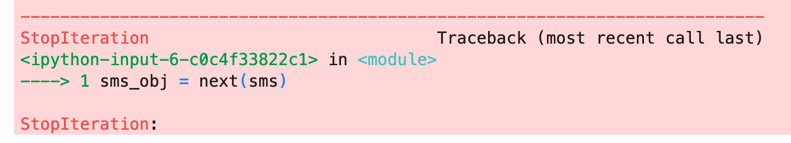

## Twilio sms Sample Code

* Sign up for a trial account at

>```https://www.twilio.com/try-twilio```

* Please install the twilio package in your conda environment by running the following command in the terminal

>``` pip install twilio ```

* Add the twilio API key parameters to your .env file

>```TWILIO_ACCOUNT_SID = "your-account-sid-goes-here"```
>```TWILIO_AUTH_TOKEN = "your-auth-token-goes-here"```

***Reference: https://www.twilio.com/blog/build-sms-dashboard-python-flask-twilio***

***Please make sure that you send an sms message to the phone number in twilio first before running this code***

Otherwise you may receive this error:

  *  *  *  *  *